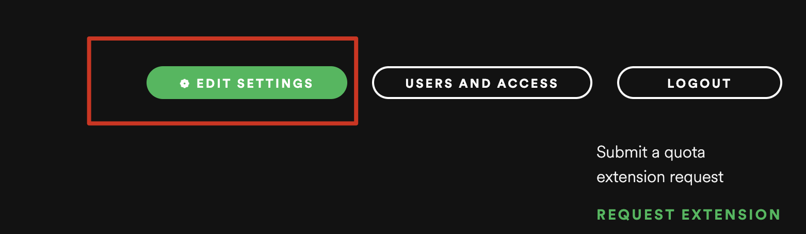
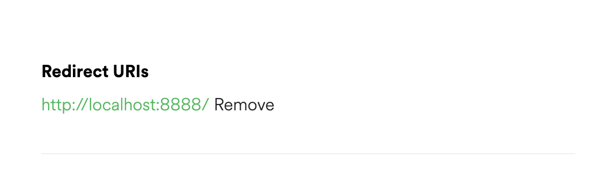
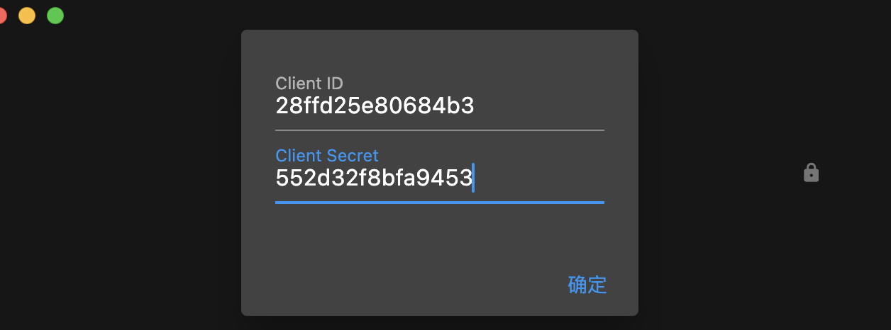
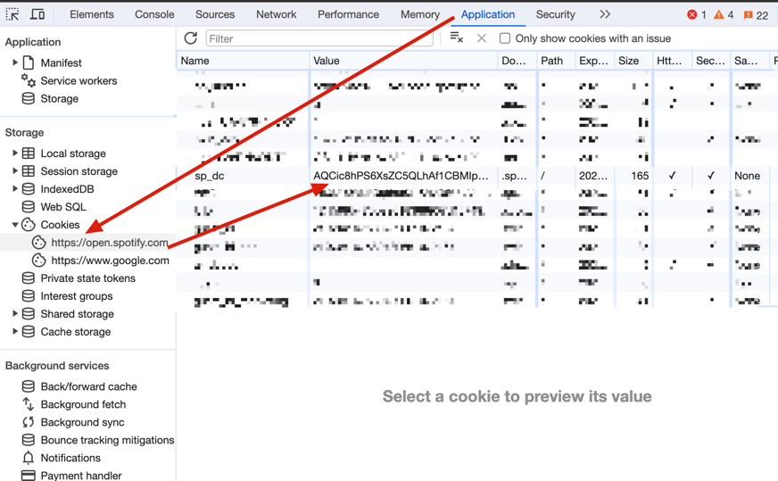
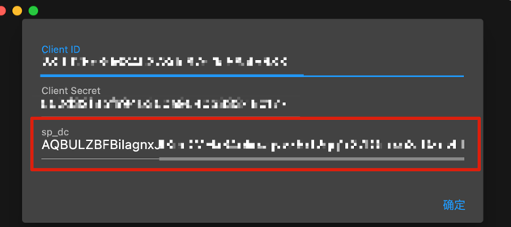
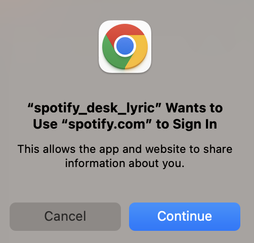

# spotify_desk_lyric

This is a simple floating lyrics client for Spotify.

* Please note that I am NOT intend to maintain this package in long term
* If you are interested in the package and want to customize it, feel free to raise PRs
* I am not going to purchase any Spotify Api Quota, so you might need to create your own spotify api
  client.
* Please Read the instruction before you use.
* This is a project for fun, so you will find out the code is pretty disorganized lol.

## Getting Started

Step 1. Login to spotify developer dashboard with your OWN
accound. https://developer.spotify.com/dashboard/

Step 2. Create an App in the dashboard. You can choose any name you want for the app name.

Step 3. Enter the App and click `EDIT SETTINGS`, and add `http://localhost:8888/`
under `Redirect URIs` then save.

Step 4. Open the app you have downloaded. Put the ClientId and ClientSecret into the textfield and
click `Confirm`.

Step 5. Login to Spotify Web Player https://open.spotify.com/, in your
browser, Go to Inspect(Right Click on WebSite or use Fn+F12) -> Go to Application -> Cookies.
Find out the sp_dc value and paste it to the third field of the analog.

Step 6. If everything is going well, a dialog will show up and redirect you to spotify login page.
Please login. Everything you filled in in step 4 - 5 will be stored in local storage, sp_dc will be
valid for 1 year. So you dont need to go through all these steps everytime you open the app.

Step 7. Enjoy!

***The Lock icon at the right side of the App can be used to set the app always on Top on the
desktop. If you want to enter full screen mode on Macos, the lock should not be activated.***

***No need to worry about if you need to do all the steps everytime you run the app, the ClientId
and ClientSecret and Spotify Login Session will be stored***
